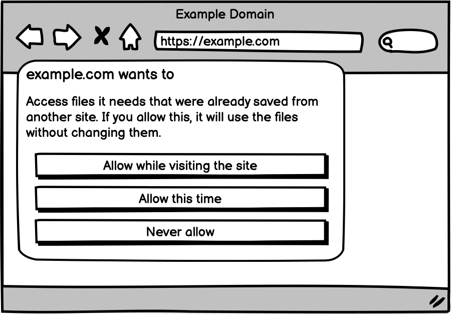

# Explainer for the Cross-Origin Storage (COS) API


This proposal outlines the design of the **Cross-Origin Storage (COS)** API, which allows web applications to store and retrieve files across different origins with explicit user consent. Using concepts introduced in **File System Living Standard** defined by the WHATWG, the COS API facilitates secure cross-origin file storage and retrieval for large files, such as AI models, SQLite databases, offline storage archives, and WebAssembly (Wasm) modules. Taking inspiration from **Cache Digests for HTTP/2**, the API uses file hashes for integrity.

This proposal is an early design sketch by Chrome Developer Relations to describe the problem below and solicit feedback on the proposed solution. It has not been approved to ship in Chrome.

## Authors

- [Thomas Steiner](mailto:tomac@google.com), Google Chrome
- [Christian Liebel](mailto:christian@liebel.org), Thinktecture AG
- [François Beaufort](mailto:fbeaufort@google.com), Google Chrome

## Participate

- [Issues](https://github.com/tomayac/cross-origin-storage/issues)
- [PRs](https://github.com/tomayac/cross-origin-storage/pulls)

## Introduction

The **Cross-Origin Storage (COS)** API provides a cross-origin file storage and retrieval mechanism for web applications. It allows applications to store and access large files, such as AI models, SQLite databases, offline storage archives, and Wasm modules across different origins securely and with user consent. Taking inspiration from **Cache Digests for HTTP/2**, files are identified by their hashes to ensure integrity. The API uses concepts like `FileSystemFileHandle` from the **File System Living Standard** with a focus on cross-origin usage particularities. Here's an example that shows the basic flow for retrieving a file from COS, which requires [transient activation](https://html.spec.whatwg.org/multipage/interaction.html#transient-activation):

```js
// The hash of the desired file.
const hash = {
  algorithm: 'SHA-256',
  value: '8f434346648f6b96df89dda901c5176b10a6d83961dd3c1ac88b59b2dc327aa4',
};
// A user gesture like a click must have occurred before.
try {
  // This triggers a permission prompt. For example:
  // example.com wants to check if your browser already has files the site needs,
  // possibly saved from another site. If found, it will use the files without
  // changing them.
  // [Allow this time] [Allow on every visit] [Don't allow]
  const [handle] = await navigator.crossOriginStorage.requestFileHandles([hash]);
  // The file exists in Cross-Origin Storage.
  const fileBlob = await handle.getFile();
  // Do something with the blob.
  console.log('Retrieved', fileBlob);
} catch (err) {
  if (err.name === 'NotAllowedError') {
    console.log('The user did not grant permission to access the files.');
    return;
  }
  // `NotFoundError`, the files weren't found in COS.
  console.error(err.name, err.message);
}
```

## Risk awareness

> [!CAUTION]
> The authors acknowledge that storage is usually isolated by origin to safeguard user security and privacy. Storing large files like AI models or SQLite databases separately for each origin, as required by new [use cases](#use-cases), presents a different challenge. For instance, if both `example.com` and `example.org` each require the same 8&nbsp;GB AI model, this would result in a total of 16&nbsp;GB downloaded data and a total allocation of 16&nbsp;GB on the user's device. The present proposal centers on effective mechanisms that uphold protection standards while addressing the inefficiencies of duplicated download and storage.

## Goals

COS aims to:

- Provide a cross-origin storage mechanism for web applications to store and retrieve large files like AI models, SQLite databases, offline storage archives (for example, complete website archives at the scale of Wikipedia), and Wasm modules.
- Ensure security and user control with explicit consent before accessing or storing files.
- Use SHA-256 hashes (see [Appendix&nbsp;B](#appendixb-blob-hash-with-the-web-crypto-api)) for file identification, guaranteeing data integrity and consistency.
- Make the web more sustainable and ethical by reducing the number of redundant huge downloads of files the user agent already has potentially stored locally.

## Non-goals

COS does _not_ aim to:

- Replace existing storage solutions such as the **Origin Private File System**, the **Cache API**, **IndexedDB**, or **Web Storage**.
- Replace content delivery networks (CDNs). The required prompting is expected to deter websites from using the COS API unless there's a clear benefit to cross-origin file access, such as potentially utilizing a cached version.
- Store popular JavaScript libraries like jQuery. (See the [FAQ](#appendixc-frequently-asked-questions-faq).)
- Allow cross-origin file access _without_ explicit user consent.

> [!IMPORTANT]
> COS has distinct objectives from the [Shared Storage API](https://github.com/WICG/shared-storage) proposal, which serves as common key/value storage infrastructure for privacy-preserving cross-site use cases.
>
> It's also distinct from the [Related Website Partition API](https://github.com/explainers-by-googlers/related-website-partition-api) proposal, which allows third-party embeds to request access to a storage partition that is accessible across sites in a single [Related Website Set](https://wicg.github.io/first-party-sets/).

## User research

Feedback from developers working with large AI models, SQLite databases, offline storage archives, and Wasm modules has highlighted the need for an efficient way to store and retrieve such large files across web applications on different origins. These developers are looking for a standardized solution that allows files to be stored once and accessed by multiple applications, without needing to download and store the files redundantly. COS ensures this is possible while maintaining privacy and security via user consent.

### User feedback example: Hugging Face

[Joshua Lochner](https://huggingface.co/Xenova) (aka. Xenova) from Hugging Face had the following to say in his [talk at the Chrome Web AI Summit](https://youtu.be/n18Lrbo8VU8?t=1040):

> _"One can imagine a browser-based web store for models similar to the Chrome Web Store for extensions. From the user's perspective, they could search for web-compatible models on the Hugging Face hub, install it with a single click, and then access it across multiple domains. Currently, Transformers.js is limited in this regard, since models are cached on a per site or per extension basis."_

### User feedback example: Web Machine Learning Working Group

Participants of the Web Machine Learning Working Group at the W3C in their meeting on September 21, 2023, discussed [Storage APIs for caching large models](https://www.w3.org/2023/09/21-webmachinelearning-minutes.html#t03). A proposal named [Hybrid AI Explorations](https://github.com/webmachinelearning/proposals/issues/5) listed the following open issues:

> _"If the model runs on the client, large models need to be downloaded, possibly multiple times in different contexts. This incurs a startup latency."_
>
> _"Models are large and can consume significant storage on the client, which needs to be managed."_

This led to the creation of a dedicated [Hybrid AI explainer](https://github.com/webmachinelearning/hybrid-ai/blob/main/explainer.md), which in its introduction states:

> _"For example, ML models are large. This creates network cost, transfer time, and storage problems. As mentioned, client capabilities can vary. This creates adaptation, partitioning, and versioning problems. We would like to discuss potential solutions to these problems, such as shared caches, progressive model updates, and capability/requirements negotiation."_

## Use cases

### Use case 1: Large AI models

Developers working with large AI models can store these models once and access them across multiple web applications. By using the COS API, models can be stored under their hashes and retrieved with user consent, minimizing repeated downloads and storage, ensuring file integrity. An example is Google's [Gemma 2](https://huggingface.co/google/gemma-2-2b/tree/main) model [`g-2b-it-gpu-int4.bin`](https://storage.googleapis.com/jmstore/kaggleweb/grader/g-2b-it-gpu-int4.bin') (1.35&nbsp;GB). Another example is Google's [Gemma 1.1 7B](https://huggingface.co/google/gemma-1.1-7b-it) model `gemma-1.1-7b-it` (8.60&nbsp;GB), which can be [run in the browser](https://research.google/blog/unlocking-7b-language-models-in-your-browser-a-deep-dive-with-google-ai-edges-mediapipe/). Yet another example is the [`Llama-3.1-70B-Instruct-q3f16_1-MLC`](https://huggingface.co/mlc-ai/Llama-3.1-70B-Instruct-q3f16_1-MLC/tree/main) model (33&nbsp;GB), which [likewise runs in the browser](https://chat.webllm.ai/) (choose the "Llama 3.1 70B Instruct" model in the picker).

### Use case 2: Large database files and offline storage archives

Web applications may depend on large SQLite databases, for example, for geodata as provided by Geocode Earth [`whosonfirst-data-admin-latest.db.bz2`](https://geocode.earth/data/whosonfirst/combined/) (8.00&nbsp;GB). Another use case involves large archives, for example, [ZIM files](https://wiki.openzim.org/wiki/ZIM_file_format) like [`wikipedia_en_all_maxi_2024-01.zim`](https://library.kiwix.org/#lang=eng&category=wikipedia) (109.89&nbsp;GB) as used by PWAs like [Kiwix](https://pwa.kiwix.org/www/index.html). Storing such files once with the COS API has the advantage that multiple web apps can share the same files.

### Use case 3: Large Wasm modules

Web applications that utilize large Wasm modules can store these modules using COS and access them across different origins. This enables efficient sharing of files between applications, reducing redundant downloading and improving performance. Google's Flutter framework alone has four files that are used by more than 1,000 hosts each day making more than two million daily requests in total.

| Request (`https://gstatic.com/flutter-canvaskit/`)                                                                                                                           | Size   | Hosts | Requests |
| ---------------------------------------------------------------------------------------------------------------------------------------------------------------------------- | ------ | ----- | -------- |
| [`36335019a8eab588c3c2ea783c618d90505be233/chromium/canvaskit.wasm`](https://gstatic.com/flutter-canvaskit/36335019a8eab588c3c2ea783c618d90505be233/chromium/canvaskit.wasm) | 5.1 MB | 1,938 | 596,900  |
| [`a18df97ca57a249df5d8d68cd0820600223ce262/chromium/canvaskit.wasm`](https://gstatic.com/flutter-canvaskit/a18df97ca57a249df5d8d68cd0820600223ce262/chromium/canvaskit.wasm) | 5.1 MB | 1,586 | 579,380  |
| [`36335019a8eab588c3c2ea783c618d90505be233/canvaskit.wasm`](https://gstatic.com/flutter-canvaskit/36335019a8eab588c3c2ea783c618d90505be233/canvaskit.wasm)                   | 6.4 MB | 1,142 | 597,240  |
| [`a18df97ca57a249df5d8d68cd0820600223ce262/canvaskit.wasm`](https://gstatic.com/flutter-canvaskit/a18df97ca57a249df5d8d68cd0820600223ce262/canvaskit.wasm)                   | 6.4 MB | 1,014 | 288,800  |

(**Source:** Google-internal data from the Flutter team: "Flutter engine assets by unique hosts - one day - Dec 10, 2024".)

## Potential solution

### File Storage Process

The **COS** API will be available through the `navigator.crossOriginStorage` interface. Files will be stored and retrieved using their hashes, ensuring that each file is uniquely identified.

- Storing files can happen at any time and doesn't require [user activation](https://html.spec.whatwg.org/multipage/interaction.html#transient-activation).
- Retrieving files requires [transient activation](https://html.spec.whatwg.org/multipage/interaction.html#transient-activation).

#### Storing files

1. Hash the contents of the files using SHA-256 (or an equivalent secure algorithm, see [Appendix&nbsp;B](#appendixb-blob-hash-with-the-web-crypto-api)). The used hash algorithm is communicated as a valid [`HashAlgorithmIdentifier`](https://w3c.github.io/webcrypto/#dom-hashalgorithmidentifier).
1. Request a sequence of `FileSystemFileHandle` objects for the files, specifying the files' hashes.
1. Each of the `FileSystemFileHandle` objects in the resulting sequence of `FileSystemFileHandle` objects can only be used for writing. Trying to read would fail with a `NotAllowed` `DOMException`.
1. Store the files in the user agent.

##### Example: Storing a single file

```js
/**
 * Example usage to store a single file.
 */

// The hash of the desired file.
const hash = {
  algorithm: 'SHA-256',
  value: '8f434346648f6b96df89dda901c5176b10a6d83961dd3c1ac88b59b2dc327aa4',
};

// First, check if the file is already in COS.
try {
  // This triggers a permission prompt. For example:
  // example.com wants to check if your browser already has files the site needs,
  // possibly saved from another site. If found, it will use the files without
  // changing them.
  // [Allow this time] [Allow on every visit] [Don't allow]
  const [handle] = await navigator.crossOriginStorage.requestFileHandles([hash]);
  // The file exists in COS.
  const fileBlob = await handle.getFile();
  // Do something with the blob.
  console.log('Retrieved', fileBlob);
  return;
} catch (err) {
  // If the file wasn't in COS, load it from the network and store it in COS.
  if (err.name === 'NotFoundError') {
    // Load the file from the network.
    const fileBlob = await loadFileFromNetwork();
    try {
      const [handle] = await navigator.crossOriginStorage.requestFileHandles(
        [hash],
        {
          create: true,
        },
      );
      // The resulting `FileSystemFileHandle` can only be used for writing.
      // Trying to call `handle.getFile()` would fail with a `NotAllowed`
      // `DOMException`.
      const writableStream = await handle.createWritable();
      await writableStream.write(fileBlob);
      await writableStream.close();
    } catch (err) {
      // The `write()` failed.
    }
    return;
  }
  // 'NotAllowedError', the user didn't grant access to the file.
  console.log('The user did not grant access to the file.');
}
```

##### Example: Storing multiple files

```js
/**
 * Example usage to store multiple files.
 */

// The hashes of the desired files.
const hashes = [{
  algorithm: 'SHA-256',
  value: '8f434346648f6b96df89dda901c5176b10a6d83961dd3c1ac88b59b2dc327aa4',
}, {
  algorithm: 'SHA-256',
  value: 'ba7816bf8f01cfea414140de5dae2223b00361a396177a9cb410ff61f20015ad',
}];

// First, check if the files are already in COS.
try {
  // This triggers a permission prompt. For example:
  // example.com wants to check if your browser already has files the site needs,
  // possibly saved from another site. If found, it will use the files without
  // changing them.
  // [Allow this time] [Allow on every visit] [Don't allow]
  const handles = await navigator.crossOriginStorage.requestFileHandles(hashes);
  // The files exist in COS.
  for (const handle of handles) {
    const fileBlob = await handle.getFile();
    // Do something with the blob.
    console.log('Retrieved', fileBlob);
  }
  return;
} catch (err) {
  // If the files weren't in COS, load them from the network and store them in
  // COS. The method throws a `NotFoundError` `DOMException` if _any_ of the
  // files isn't found.
  if (err.name === 'NotFoundError') {
    try {
      // Load the files from the network.
      const fileBlobs = await loadFilesFromNetwork();
      const handles = await navigator.crossOriginStorage.requestFileHandles(
        hashes,
        {
          create: true,
        },
      );
      handles.forEach((handle, i) => {
        // The resulting `FileSystemFileHandle` can only be used for writing.
        // Trying to call `handle.getFile()` would fail with a `NotAllowed`
        // `DOMException`.
        const writableStream = await handle.createWritable();
        await writableStream.write(fileBlobs[i]);
        await writableStream.close();
      });
    } catch (err) {
      // The `write()` failed.
    }
    return;
  }
  // 'NotAllowedError', the user didn't grant access to the file.
  console.log('The user did not grant access to the file.');
}
```

#### Retrieving files

1. If the [relevant global object](https://html.spec.whatwg.org/multipage/webappapis.html#concept-relevant-global) of [this](https://webidl.spec.whatwg.org/#this) does not have [transient activation](https://html.spec.whatwg.org/multipage/interaction.html#transient-activation), return a new promise rejected with a [`"NotAllowedError"`](https://webidl.spec.whatwg.org/#notallowederror) [`DOMException`](https://webidl.spec.whatwg.org/#idl-DOMException).
1. Request a sequence of `FileSystemFileHandle` objects for the files, specifying the files' hashes. This will trigger a permission prompt if it's okay for the origin to check if the files are stored by the user agent.
1. Retrieve the sequence of `FileSystemFileHandle` objects after the user has granted access.

##### Example: Retrieving a single file

```js
/**
 * Example usage to retrieve a single file.
 */

// The hash of the desired file.
const hash = {
  algorithm: 'SHA-256',
  value: '8f434346648f6b96df89dda901c5176b10a6d83961dd3c1ac88b59b2dc327aa4',
};

// This triggers a permission prompt. For example:
// example.com wants to check if your browser already has files the site needs,
// possibly saved from another site. If found, it will use the files without
// changing them.
// [Allow this time] [Allow on every visit] [Don't allow]
try {
  const [handle] = await navigator.crossOriginStorage.requestFileHandles([hash]);
  // The file exists in COS.
  const fileBlob = await handle.getFile();
  console.log('Retrieved file', fileBlob);
  // Return the file as a Blob.
  console.log(fileBlob);
} catch (err) {
  if (err.name === 'NotFoundError') {
    // Load the file from the network.
    const fileBlob = await loadFileFromNetwork();
    // Return the file as a Blob.
    console.log(fileBlob);
    return;
  }
  // 'NotAllowedError', the user didn't grant access to the file.
  console.log('The user did not grant access to the file.');
}
```

##### Example: Retrieving multiple files

```js
/**
 * Example usage to retrieve multiple files.
 */

// The hashes of the desired files.
const hashes = [{
  algorithm: 'SHA-256',
  value: '8f434346648f6b96df89dda901c5176b10a6d83961dd3c1ac88b59b2dc327aa4',
}, {
  algorithm: 'SHA-256',
  value: 'ba7816bf8f01cfea414140de5dae2223b00361a396177a9cb410ff61f20015ad',
}];

// This triggers a permission prompt. For example:
// example.com wants to check if your browser already has files the site needs,
// possibly saved from another site. If found, it will use the files without
// changing them.
// [Allow this time] [Allow on every visit] [Don't allow]
try {
  const handles = await navigator.crossOriginStorage.requestFileHandles(hashes);
  // The files exist in COS.
  for (const handle of handles) {
    const fileBlob = await handle.getFile();
    // Return the file as a Blob.
    console.log('Retrieved file', fileBlob);
  }
} catch (err) {
  if (err.name === 'NotFoundError') {
    // Load the files from the network.
    const fileBlobs = await loadFilesFromNetwork();
    // Return the files as a Blob.
    console.log(fileBlobs);
    return;
  }
  // 'NotAllowedError', the user didn't grant access to the files.
  console.log('The user did not grant access to the files.');
}
```

#### Storing and retrieving a file across unrelated sites

To illustrate the capabilities of the COS API, consider the following example where two unrelated sites want to interact with the same large language model. The first site stores the model in COS, while the second site retrieves it.

##### Site A: Storing a large language model

On Site A, a web application stores a large language model in COS.

```js
// The hash of the desired file.
const hash = {
  algorithm: 'SHA-256',
  value: '8f434346648f6b96df89dda901c5176b10a6d83961dd3c1ac88b59b2dc327aa4',
};

// This triggers a permission prompt. For example:
// site-a.example.com wants to check if your browser already has files the site
// needs, possibly saved from another site. If found, it will use the files
// without changing them.
// [Allow this time] [Allow on every visit] [Don't allow]
try {
  const [handle] = await navigator.crossOriginStorage.requestFileHandles([hash]);

  // Use the file and return.
  // …
  return;
} catch (err) {
  if (err.name === 'NotFoundError') {
    // Load the file from the network.
    const fileBlob = await loadFileFromNetwork();
    // Compute the control hash using the method in Appendix B.
    const controlHash = await getBlobHash(fileBlob);
    // Check if control hash and known hash are the same.
    if (controlHash !== hash.value) {
      // Downloaded file and desired file are different.
      // …
      return;
    }
    try {
      const [handle] = await navigator.crossOriginStorage.requestFileHandles([hash], {
        create: true,
      });
      // The resulting `FileSystemFileHandle` can only be used for writing.
      // Trying to call `handle.getFile()` would fail with a `NotAllowed`
      // `DOMException`.
      const writableStream = await handle.createWritable();
      await writableStream.write(fileBlob);
      await writableStream.close();

      console.log('File stored.');
    } catch (err) {
      // The `write()` failed.
    }
    return;
  }
  // 'NotAllowedError', the user didn't grant access to the file.
  console.log('The user did not grant access to the file.');
}
```

##### Site B: Retrieving the same model

On Site B, entirely unrelated to Site A, a different web application happens to retrieve the same model from COS.

```js
// The hash of the desired file.
const hash = {
  algorithm: 'SHA-256',
  value: '8f434346648f6b96df89dda901c5176b10a6d83961dd3c1ac88b59b2dc327aa4',
};

// This triggers a permission prompt. For example:
// site-b.example.com wants to check if your browser already has files the site
// needs, possibly saved from another site. If found, it will use the files
// without changing them.
// [Allow this time] [Allow on every visit] [Don't allow]
try {
  const [handle] = await navigator.crossOriginStorage.requestFileHandles([hash]);
  const fileBlob = await handle.getFile();
  console.log('File retrieved', fileBlob);
  // Use the fileBlob as needed.
} catch (err) {
  if (err.name === 'NotFoundError') {
    // The file wasn't in COS.
    console.error(err.name, err.message);
    return;
  }
  // 'NotAllowedError', the user didn't grant access to the file.
  console.log('The user did not grant access to the file.');
}
```

##### Key points

- **Unrelated sites:** The two sites belong to different origins and do not share any context, ensuring the example demonstrates cross-origin capabilities.
- **Cross-origin sharing:** Despite the different origins, the files are securely identified by their hashes, demonstrating the API's ability to facilitate cross-origin file storage and retrieval.

## Detailed design discussion

### User consent and permissions

The permission prompt must clearly convey that the user agent is granting access to shared files. The goal is to strike a balance between providing sufficient technical details and maintaining user-friendly simplicity.

An **access permission** will be shown every time the `navigator.crossOriginStorage.requestFileHandles(hashes)` method is called _without_ the `create` option set to `true`, which can happen to check for existence of files and to obtain the handles to then get the actual files.

Accessing files requires [transient activation](https://html.spec.whatwg.org/multipage/interaction.html#transient-activation). Storing files can happen at any time and doesn't require [user activation](https://html.spec.whatwg.org/multipage/interaction.html#transient-activation).

Each of the `FileSystemFileHandle` objects in the resulting sequence of `FileSystemFileHandle` objects that the developer obtains when `create` is set to `true` can only be used for writing. Trying to call `FileSystemFileHandle.getFile()` would fail with a `NotAllowed` `DOMException`.

Following an initial required permission, user agents can decide to allow access on every following visit, or to explicitly ask upon each access attempt.

A change in the order of the hashes in the `hashes` array doesn't matter when accessing the same set of files repeatedly for reading, that is, no new permission prompt is required. It's also allowed to request reading access to just a subset of previously accessed files without triggering another permission prompt.

If an origin itself has stored the file before, the user agent can decide to not show a prompt if the same origin requests access to the file again.

If the user agent knows that the file exists, it can customize the permission prompt to differentiate the existence check and the access prompt.

> [!IMPORTANT]
> All permission strings in this explainer are purely for illustrative purposes. User agents are expected to customize them.

- If the files don't exist:
  
- If the files do exist:
  

> [!IMPORTANT]
> The permission could mention other recent origins that have accessed the same files, but this may be misinterpreted by the user as information the current site may learn, which is never the case. Instead, the vision is that user agents would make information about origins that have (recently) accessed files stored in COS available in special user agent settings UI, as outlined in [Handling of eviction](#handling-of-eviction).

### Privacy

Since the files are retrieved only upon explicit user permission, there's no way for files stored in COS to become supercookies without raising the user's suspicion. Privacy-sensitive user agents can decide to prompt upon every retrieval operation, others can decide to only prompt once, and auto-allow from thereon. User agents can decide to not prompt if the present origin has stored the file before.

### Hashing

The current hashing algorithm is [SHA-256](https://w3c.github.io/webcrypto/#alg-sha-256), implemented by the **Web Crypto API**. If hashing best practices should change, COS will reflect the [implementers' recommendation](https://w3c.github.io/webcrypto/#algorithm-recommendations-implementers) in the Web Crypto API.

The used hashing algorithm is encoded in each hash object's `algorithm` field of the `hashes` array as a [`HashAlgorithmIdentifier`](https://w3c.github.io/webcrypto/#dom-hashalgorithmidentifier). This flexible design allows changing the hashing algorithm in the future.

```js
const hashes = [{
  algorithm: 'SHA-256',
  value: '8f434346648f6b96df89dda901c5176b10a6d83961dd3c1ac88b59b2dc327aa4',
}];
```

### Web sustainability

In the context of [evaluating carbon emissions in digital data usage](https://websitesustainability.com/cache/files/research23.pdf), current methodologies predominantly utilize a [kilowatt-hour (kWh) per gigabyte (GB) framework](https://sustainablewebdesign.org/estimating-digital-emissions/) to estimate the operational energy intensity of data transmission and storage. This approach provides the following energy consumption benchmarks:

- **Network transmission:** 0.013&nbsp;kWh/GB
- **User devices:** 0.081&nbsp;kWh/GB

While this document doesn't aim to critically assess the precision of these estimates, it's an established principle that minimizing redundant data downloads and storage is inherently beneficial for sustainability. The [Ethical Web Principles](https://w3ctag.github.io/ethical-web-principles/) specifically highlight that the Web [_"is an environmentally sustainable platform"_](https://w3ctag.github.io/ethical-web-principles/#sustainable) and suggest _"lowering carbon emissions by minimizing data storage and processing requirements"_ as measures to get there. Consequently, one of the key objectives of the COS API is to enhance Web sustainability by reducing redundant large file downloads when such files are possibly already stored locally on the user's device.

> [!IMPORTANT]
> In the context of AI, its implications for sustainability efforts are undeniable. It's essential to adhere to [Web Sustainability Guidelines](https://w3c.github.io/sustainableweb-wsg/) when integrating AI solutions. Prior to implementing AI, it's recommended to [assess and research visitor needs](https://w3c.github.io/sustainableweb-wsg/#assess-and-research-visitor-needs) to ensure that AI is a justifiable and effective solution that truly improves the experience. For example, by increasing user privacy of video calls by applying AI-based background blurring.

## Open questions

### Concurrency

What should happen if two tabs depend on the same file, check COS, see the file is not in COS, and start downloading? Should this be handled smartly? How often does this happen in practice? In the worst case, the file gets downloaded twice, but would then still only be stored once in COS. Our current thinking is to not deal with this special case based on the tolerable worst case.

### Partial COS matches

If the developer wants to check if two files A and B, with the hashes hash_A and hash_B are stored in COS, but only one of the two is stored, the API will still fail with a `NotFoundError` `DOMException` without revealing the partial match. Should it? Our current thinking is that it complicates error handling, especially since the expected use cases commonly require all files to be present for the app to function, for example, the tokenizer, configurations, weights, and graph with an AI model. Additionally, it's preferable to not reveal partial matches for privacy reasons, as this would allow (very limited) enumeration of COS contents.

### Minimum file size

Should there be a required minimum file size for a file to be eligible for COS? Most likely not, since it would be trivial to inflate the file size of non-qualifying files by adding space characters or comments. The assumption is that the required prompting would be scary enough for websites to only use COS for files where it really makes sense to have them available cross-origin, that is, where they could profit themselves from using a potentially already cached version rather than downloading their own version from the network.

### Handling of eviction

Under critical storage pressure, user agents could offer a dialog that invites the user to manually free up storage. The user agent could also delete files automatically based on, for example, a least recently used approach.

User agents are further envisioned to offer user agent settings UI for the user to see what files are stored in COS and what origins have (least) recently used each file. The user can then choose to delete files from COS using this UI.

When the user clears site data, all usage information associated with the origin should be removed from files in COS. If a file in COS, after the removal of usage information, is deemed unused, the user agent may delete it from COS.

### Manual COS management

If a user already has manually downloaded a file like a large AI model, should the user agent offer a way to let the user put the file in COS? This could just be an affordance provided by the user agent.

## Considered alternatives

### Adding a description for each file apart from the hash

Apps could reference to the same file identified by a unique hash using different descriptions. For example, an English site could refer to the [`g-2b-it-gpu-int4.bin`](https://storage.googleapis.com/jmstore/kaggleweb/grader/g-2b-it-gpu-int4.bin) AI model as "Gemma AI model from Google", whereas another Spanish site could refer to it as "modelo de IA grande de Google". This information could in theory even be surfaced in the permission prompt. In practice, though, we fear attacks where sites set descriptions like "Click 'Accept' to prove that you are not a bot", which should never make it into a permission prompt. Further, the description could also be inaccurate or deceptive.

Instead, we envision user agents to enrich permission prompts based on the hashes. For example, a user agent could know that a file identified by a given hash is a well-known AI model and optionally surface this information to the user in the permission prompt.

### Storing files without hashing

Storing files by their names rather than using hashes would risk name collisions, especially in a cross-origin environment. The use of hashes guarantees unique identification of each file, ensuring that the contents are consistently recognized and retrieved. Storing files based on their URLs would work if apps reference the same URLs, for example, on the same CDN, but wouldn't work if apps reference the same file stored at different locations.

### Manually accessing files from harddisk

Different origins can manually open the same file on disk, either using the File System Access API's `showOpenFilePicker()` method or using the classic `<input type="file">` approach. This requires the file to be stored once, and access to the file can then be shared as explained in [Cache AI models in the browser](https://developer.chrome.com/docs/ai/cache-models#special_case_use_a_model_on_a_hard_disk). While this works, it's manual and error-prone, as it requires the user to know what file to choose from their harddisk in the file picker.

### Integrating cross-origin storage in the `fetch()` API

On the server, cross-origin isolation isn't really a problem. At the same time, server runtimes like Node.js, Bun, or Deno implement `fetch()` as well. To avoid fragmentation and to keep the present `fetch()` API simple, it probably doesn't make sense to add COS to `fetch()`. Since `fetch()` is URL-based, this would also not solve the case where the same file is stored at different locations.

### Integrating cross-origin storage in the Cache API

The Cache API is fundamentally modeled around the concepts of `Request` or URL strings, and `Response`, for example, `Cache.match()` or `Cache.put()`. In contrast, what makes COS unique is that it uses file hashes as the keys to files to avoid duplicates.

### Solving the problem only for AI models

AI models are admittedly the biggest motivation for working on COS, so one alternative would be to solve the problem exclusively for AI models, for example, by offering a storage mechanism on the `self.ai.*` namespace that Chrome is experimenting with in the context of built-in AI APIs like the [Prompt API](https://github.com/webmachinelearning/prompt-api) proposal. Two questions arise in the context: First, how would it be enforced that files are really AI models? Second, `self.ai.*` is explicitly focused on built-in AI APIs where the model is provided by the user agent and not by the developer. Given this background, this approach doesn't seem like a great fit, and, maybe more importantly, the non-AI [use cases](#use-cases) are well worth solving, too.

## Security and privacy considerations

See the complete [questionnaire](security-privacy-questionnaire.md) for details.

### Security considerations

The API mandates [transient activation](https://html.spec.whatwg.org/multipage/interaction.html#transient-activation) and [explicit user consent](#user-consent-and-permissions) before any reading cross-origin file access operation, and permission prompts clearly inform users of the requesting site's intent, providing options to allow or deny access. There's no implicit cross-origin information leakage as files in COS are inaccessible without explicit user permission, ensuring no site can infer the presence or absence of specific files across origins without user interaction. User agents can customize permission prompts to minimize confusion while providing transparency. For example, user agents may decide that origins that stored files previously may access them without prompting, provided user agents deem it safe.

Access is scoped to individual files, [each identified by their hash](#hashing). Developers can't arbitrarily access any random files, ensuring limited and precise access control. Files are uniquely identified by their cryptographic hashes (for example, SHA-256), ensuring data integrity. Hashes prevent tampering with the file contents, that is, a site can be sure it gets the same contents from COS as if it had downloaded the file itself, as COS guarantees that each file's contents matches its hash.

File handles provided by the API can [only perform specific operations based on their context](#user-consent-and-permissions) (for example, writing, but not reading, during creation). Misuse of file handles is mitigated by these constraints.

User agents are envisioned to offer [settings UI for managing COS files](#handling-of-eviction), showing stored files and their associated origins. Users can manually evict files or clear all COS data, maintaining control over their storage.

 We envision user agents to enrich permission prompts based on the file hashes. For example, a user agent could know that a file identified by a given hash is a well-known AI model and optionally surface this information to the user in the permission prompt.

### Privacy considerations

The required transient activation and the use of explicit user permission ensures that COS cannot be exploited for tracking or persistent storage across origins without user awareness. Files in COS can't become involuntary [supercookies](https://blog.mozilla.org/en/internet-culture/mozilla-explains-cookies-and-supercookies/) without the user noticing.

Prompts can [differentiate between file existence checks and access requests](#user-consent-and-permissions), reducing the risk of misuse or user misunderstanding. Recent origin access to a file is only visible to users via envisioned user agent settings UI, not to other origins.

COS [use cases](#use-cases) are limited on purpose to mitigate abuse. The API is designed for large files, discouraging use for smaller assets like JavaScript libraries. Its permission model inherently discourages overuse due to user interruption.

Files in COS may be evicted under critical storage pressure, maintaining system performance and preventing abuse of storage space.

## Stakeholder feedback / opposition

- **Web Developers**: [Positive feedback](#user-research) for enabling sharing large files without repeated downloads and storage, particularly in the context of huge AI models, SQLite databases, offline storage archives, and large Wasm modules.

## References

- [File System Living Standard](https://fs.spec.whatwg.org/)
- [Web Cryptography API](https://w3c.github.io/webcrypto/)
- [Cache Digests for HTTP/2](https://datatracker.ietf.org/doc/html/draft-ietf-httpbis-cache-digest)
- [Web Sustainability Guidelines (WSG)](https://w3c.github.io/sustainableweb-wsg/)
- [Ethical Web Principles](https://w3ctag.github.io/ethical-web-principles/)

## Acknowledgements

Many thanks for valuable feedback from:

- **Yash Raj Bharti**, independent freelancer
- **Joshua Lochner**, Hugging Face

Many thanks for valuable inspiration or ideas from:

- **Kenji Baheux**, Google Chrome
- **Kevin Moore**, Google Chrome

## Appendices

### Appendix&nbsp;A: Full IDL

```webidl
interface mixin NavigatorCrossOriginStorage {
  [SameObject, SecureContext] readonly attribute CrossOriginStorageManager crossOriginStorage;
};
Navigator includes NavigatorCrossOriginStorage;

[Exposed=(Window), SecureContext]
interface CrossOriginStorageManager {
  Promise<sequence<FileSystemFileHandle>> requestFileHandles(
      sequence<CrossOriginStorageRequestFileHandleHash> hashes,
      CrossOriginStorageRequestFileHandleOptions options = {});
};

dictionary CrossOriginStorageRequestFileHandleHash {
  DOMString value;
  DOMString algorithm;
}

dictionary CrossOriginStorageRequestFileHandleOptions {
  optional boolean create = false;
}
```

### Appendix&nbsp;B: Blob hash with the Web Crypto API

```js
async function getBlobHash(blob) {
  const hashAlgorithmIdentifier = 'SHA-256';

  // Get the contents of the blob as binary data contained in an ArrayBuffer.
  const arrayBuffer = await blob.arrayBuffer();

  // Hash the arrayBuffer using SHA-256.
  const hashBuffer = await crypto.subtle.digest(
    hashAlgorithmIdentifier,
    arrayBuffer,
  );

  // Convert the ArrayBuffer to a hex string.
  const hashArray = Array.from(new Uint8Array(hashBuffer));
  const hashHex = hashArray
    .map((byte) => byte.toString(16).padStart(2, '0'))
    .join('');

  return {
    algorithm: hashAlgorithmIdentifier,
    value: hashHex,
  };
}

// Example usage:
const fileBlob = await fetch('https://example.com/ai-model.bin').then(
  (response) => response.blob(),
);
getBlobHash(fileBlob).then((hash) => {
  console.log('Hash:', hash);
});
```

### Appendix&nbsp;C: Frequently asked questions (FAQ)

<details>
  <summary>
    <strong>Question:</strong> Does this API help with resuming downloads? What if downloading a large file fails before the file ends up in COS?
  </summary>
  <p>
    <strong>Answer:</strong> Managing downloads is out of scope of this proposal. COS can work with complete or with sharded files that the developer stores in COS as separate blobs and then assembles them after retrieval from COS. This way, downloads can be handled completely out-of-bounds, and developers can, for example, leverage the <a href="https://wicg.github.io/background-fetch/">Background Fetch API</a> or regular <code>fetch()</code> requests with <code>Range</code> headers to download large files.
  </p>
</details>

<details>
  <summary>
    <strong>Question:</strong> Why does this API not target popular JavaScript libraries like jQuery?
  </summary>
  <p>
    <strong>Answer:</strong> The short answer is version fragmentation. JavaScript libraries are way more fragmented than large AI models, SQLite databases, offline storage archives, and Wasm modules. The longer answer is that when the Chrome team did <a href="https://github.com/shivanigithub/http-cache-partitioning?tab=readme-ov-file#impact-on-metrics">research</a> in the context of <a href="https://github.com/shivanigithub/http-cache-partitioning">partitioning the HTTP cache</a>, they found that after partitioning the HTTP cache <em>"the overall cache miss rate increases by about 2 percentage points but changes to first contentful paint aren't statistically significant and the overall fraction of bytes loaded from the network only increase by around 1.5 percentage points"</em>. Furthermore, since the COS API <a href="#user-consent-and-permissions">requires permission</a> before accessing a file, it would, for the majority of web apps, not be practical to interrupt the user with a permission prompt for a few kilo- or megabytes of savings.
  </p>
</details>

<details>
  <summary>
    <strong>Question:</strong> What other API is this API shaped after?
  </summary>
  <p>
    <strong>Answer:</strong> The COS API is shaped after the File System Standard's <a href="https://fs.spec.whatwg.org/#api-filesystemdirectoryhandle-getfilehandle"><code>getFileHandle()</code></a> function (<code>FileSystemDirectoryHandle.getFileHandle(name, options)</code> which returns a <code>FileSystemFileHandle</code>). COS requires permission for reading and returns handles to multiple files, so its function is called <code>CrossOriginStorageManager.requestFileHandles(hashes, options)</code>. Instead of the <code>name</code> parameter, in COS, there's the <code>hashes</code> array that fulfills the equivalent function of uniquely identifying a set of files in COS. If <code>options.create</code> isn't set or is set to <code>false</code>, the user agent will, upon user consent, return handles for the files identified by the hashes value. If and only if <code>options.create</code> is set to <code>true</code>, the user agent will return handles that can be written to, but never read from. This design means it's safe to not necessarily (but still optionally) require a permission prompt for writing, but to always require a permission prompt for reading or existence checks across origins.
  </p>
</details>

<details>
  <summary>
    <strong>Question:</strong> Would the first site that added a file be seen as the authority?
  </summary>
  <p>
    <strong>Answer:</strong> No, each site has the same powers. If the user stops using the first site that has put a given file into COS, but continues using another site that depends on the same file, the file would stay around. Only if no site depends on the file anymore, the user agent may consider the file for manual or automatic removal from COS if it's under storage pressure or based on regular storage house keeping.
  </p>
</details>
